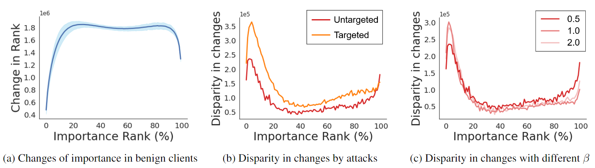

# FedCPA: Towards Attack-tolerant Federated Learning via Critical Parameter Analysis
Pytorch Implementation of "Towards Attack-tolerant Federated Learning via Critical Parameter Analysis"

 


## Highlight ##
1. We empirically show that benign local models in federated learning exhibit similar patterns in the way parameter importance changes during training. When com-
pared to the medium-ranked parameters, the top and bottom parameters had smaller rank order disruptions.
<p align="center"> </center>

2. Based on data observation that holds over non-IID cases, we present a new metric for measuring model similarity that extends beyond the extant Euclidean-based similarity. With this measure, FedCPA can efficiently assess the normality of each local update, enabling attack-tolerant aggregation.
<p align="center"> </center>

## Usage ##
```
usage: main_untargeted_attack.py [-h] [--dataset DATASET] [--net_config NET_CONFIG] [--partition PARTITION]
                                 [--batch-size BATCH_SIZE] [--lr LR] [--epochs EPOCHS] [--n_parties N_PARTIES]
                                 [--comm_round COMM_ROUND] [--init_seed INIT_SEED] [--datadir DATADIR] [--reg REG]
                                 [--logdir LOGDIR] [--modeldir MODELDIR] [--beta BETA] [--device DEVICE]
                                 [--log_file_name LOG_FILE_NAME] [--optimizer OPTIMIZER]
                                 [--global_defense GLOBAL_DEFENSE] [--attacker_type ATTACKER_TYPE]
                                 [--attacker_ratio ATTACKER_RATIO] [--noise_ratio NOISE_RATIO]
                                 
usage: main_targeted_attack.py [-h] [--dataset DATASET] [--net_config NET_CONFIG] [--partition PARTITION]
                               [--batch-size BATCH_SIZE] [--lr LR] [--epochs EPOCHS] [--n_parties N_PARTIES]
                               [--comm_round COMM_ROUND] [--init_seed INIT_SEED] [--datadir DATADIR] [--reg REG]
                               [--logdir LOGDIR] [--modeldir MODELDIR] [--beta BETA] [--device DEVICE]
                               [--log_file_name LOG_FILE_NAME] [--optimizer OPTIMIZER] [--global_defense GLOBAL_DEFENSE]
                               [--attacker_ratio ATTACKER_RATIO] [--poisoning_rate POISONING_RATE]
                               [--trigger_label TRIGGER_LABEL] [--trigger_path TRIGGER_PATH]
                               [--trigger_size TRIGGER_SIZE]

Parser

optional arguments:
  -h, --help            show this help message and exit
  --dataset DATASET     dataset used for training
  --net_config NET_CONFIG
  --partition PARTITION
                        the data partitioning strategy
  --batch-size BATCH_SIZE
                        input batch size for training
  --lr LR               learning rate (default: 0.1)
  --epochs EPOCHS       number of local epochs
  --n_parties N_PARTIES
                        number of workers in a distributed cluster
  --comm_round COMM_ROUND
                        number of maximum communication roun
  --init_seed INIT_SEED
                        Random seed
  --datadir DATADIR     Data directory
  --reg REG             L2 regularization strength
  --logdir LOGDIR       Log directory path
  --modeldir MODELDIR   Model directory path
  --beta BETA           The parameter for the dirichlet distribution for data partitioning
  --device DEVICE       The device to run the program
  --log_file_name LOG_FILE_NAME
                        The log file name
  --optimizer OPTIMIZER
                        the optimizer
  --global_defense GLOBAL_DEFENSE
                        communication strategy (average / median / krum / foolsgold / residual / trimmed_mean / norm / rfa / cpa)
  --attacker_type ATTACKER_TYPE
                        attacker type (either untargeted_gaussian untargeted_flip)
  --attacker_ratio ATTACKER_RATIO
                        ratio for number of attackers
  --noise_ratio NOISE_RATIO
                        noise ratio for label flipping (0 to 1)
  --poisoning_rate POISONING_RATE
                        poisoning portion
  --trigger_label TRIGGER_LABEL
                        The NO. of trigger label
  --trigger_path TRIGGER_PATH
                        Trigger Path
  --trigger_size TRIGGER_SIZE
                        Trigger Size
                        
```

## To run the experiment with FedCPA ##
Targeted/Untargeted attack experiments on the CIFAR-10 dataset with 20 clients and a 20% attacker's ratio.  
```
python main_targeted_attack.py --dataset cifar10 --n_parties 20 --attacker_ratio 0.2 --global_defense cpa
python main_untargeted_attack.py --dataset cifar10 --n_parties 20 --attacker_ratio 0.2 --global_defense cpa
```

## To run the experiment with other baseline defense strategies ##
Simply change the argument of "global_defense" with the strategies that you want.  
Available baseline strategies = \[average, median, krum, foolsgold, residual (Residual base), trimmed_mean, norm (Norm bound), rfa\]  
e.g., Targeted attack experiments with krum
```
python main_targeted_attack.py --dataset cifar10 --n_parties 20 --attacker_ratio 0.2 --global_defense krum
```
## Citation ##
If you find this repo useful for your research, please consider citing our paper:
```
@inproceedings{han2023towards,
  title={Towards Attack-tolerant Federated Learning via Critical Parameter Analysis},
  author={Han, Sungwon and Park, Sungwon and Wu, Fangzhao and Kim, Sundong and Zhu, Bin and Xie, Xing and Cha, Meeyoung},
  booktitle={Proceedings of the IEEE/CVF International Conference on Computer Vision},
  pages={4999--5008},
  year={2023}
}
```
